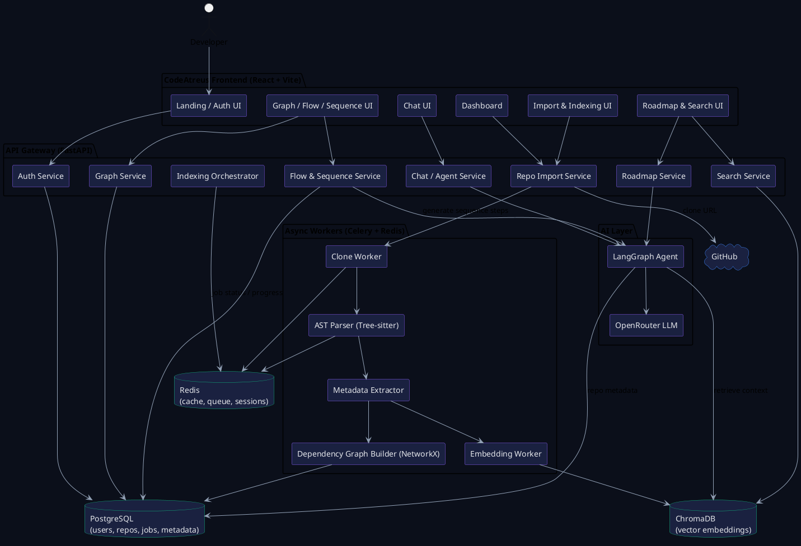
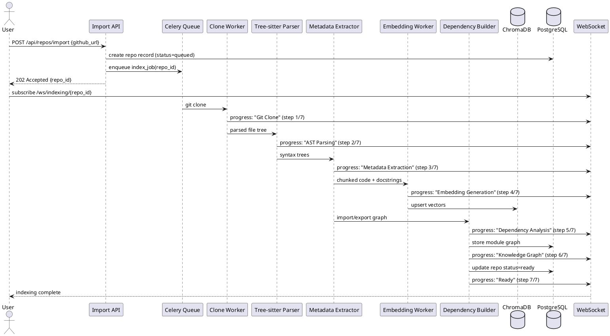

# CodeAtreus — Backend Execution Plan

**Repository Onboarding Agentic Platform**
Frontend reviewed: `App.tsx` (React 19 + Vite + Tailwind v4 + Framer Motion + Recharts)
Pages detected: `landing, login, dashboard, import, indexing, overview, chat, graph, flow, sequence, roadmap, search, settings`

This document defines a phase-wise, systematic plan to build the backend that powers every one of these screens, based on the product spec (repo import → static analysis → embeddings → knowledge graph → agentic chat → visualizations).

---

## 1. Tech Stack

| Layer | Technology | Powers Frontend Page(s) |
|---|---|---|
| API Framework | FastAPI (Python 3.11+) | all |
| Auth | JWT (access + refresh) + OAuth (GitHub) | `login`, `settings` |
| Repo Cloning | GitPython | `import`, `indexing` |
| Static Analysis | Tree-sitter (multi-language AST) | `indexing`, `overview` |
| Dependency Graph | NetworkX | `graph` |
| Embeddings | BGE-Small / Jina Embeddings | `chat`, `search` |
| Vector Store | ChromaDB | `chat`, `search` |
| Relational DB | PostgreSQL | `dashboard`, `settings`, all metadata |
| Cache / Queue | Redis + Celery (or RQ) | `indexing` (async pipeline), rate limits |
| Agent Orchestration | LangGraph + OpenRouter (Nemotron/free LLMs) | `chat`, `roadmap` |
| Diagrams | Mermaid.js (frontend render) + PlantUML (export) | `flow`, `sequence`, `graph` |
| Realtime updates | WebSockets / SSE | `indexing` progress bar, `chat` streaming |
| Deployment | Railway/Render (API) + Supabase (Postgres) + Vercel (frontend) | — |

---

## 2. High-Level System Architecture (PlantUML)



---

## 3. Async Indexing Pipeline (Sequence — PlantUML)



---

## 4. Phase-Wise Execution Plan

### **Phase 0 — Foundations (Week 0, pre-work)**
Goal: repo scaffolding, environments, CI baseline before feature work starts.

- [ ] Initialize FastAPI project (`/backend`) with `uvicorn`, `pydantic-settings`, `alembic` for migrations
- [ ] Set up PostgreSQL (local Docker + Supabase for staging) and Redis (Docker)
- [ ] Define core DB schema: `users`, `repos`, `index_jobs`, `chat_sessions`, `chat_messages`, `roadmaps`
- [ ] Set up `.env` config, CORS for the Vite frontend (`localhost:5173`)
- [ ] Docker Compose for `api + postgres + redis + celery worker`
- [ ] CI: lint (ruff), type-check (mypy), test (pytest) on push
- [ ] Health check endpoint `GET /api/health`

**Exit criteria:** frontend can hit `/api/health` from `localhost:5173` and DB migrations run cleanly.

---

### **Phase 1 — Repo Import, Parsing, Embeddings, Chat (Weeks 1–2)**
Maps to frontend pages: `login`, `import`, `indexing`, `overview`, `chat`

**1.1 Auth**
- `POST /api/auth/github` — GitHub OAuth login
- `POST /api/auth/refresh` — refresh JWT
- `GET /api/auth/me`
- Session/user tables in PostgreSQL

**1.2 Repository Import**
- `POST /api/repos/import` — accepts GitHub URL, validates, detects default branch
- `GET /api/repos` — list user's repos (→ `dashboard`)
- `GET /api/repos/{id}` — repo detail (→ `overview`)
- `DELETE /api/repos/{id}`

**1.3 Indexing Pipeline (Celery, async)**
- Clone via GitPython (shallow clone, size/time limits)
- Ignore `node_modules`, `dist`, `.git`, binaries, lockfiles > threshold
- Tree-sitter parsing per language → AST → symbol table (functions, classes, imports)
- Metadata extraction: framework detection (package.json/pyproject/pom.xml heuristics), entry points, file counts
- Chunk code (function/class granularity) → embeddings (BGE-Small/Jina) → ChromaDB collection per repo
- `GET /api/repos/{id}/status` + `WS /ws/indexing/{id}` — drives the `indexing` page's 7-step progress UI (matches `PIPELINE_STEPS` in frontend)

**1.4 Project Overview**
- `GET /api/repos/{id}/overview` — language %, framework, entry points, key files, health score
- Health score heuristic: test coverage signals, README presence, dependency freshness, file organization

**1.5 Chat (RAG, non-agentic first pass)**
- `POST /api/repos/{id}/chat` — retrieve top-k chunks from ChromaDB, call LLM via OpenRouter, return answer + cited file paths
- `GET /api/repos/{id}/chat/history`
- Streaming via SSE for token-by-token responses (→ `chat` page)

**Exit criteria:** user can paste a GitHub URL, watch indexing progress live, view an overview, and ask grounded questions with file citations.

---

### **Phase 2 — Architecture Overview, Roadmap, Dependency Graph UI (Weeks 3–4)**
Maps to frontend pages: `overview` (deep), `roadmap`, `graph` (data only), `dashboard` (analytics)

**2.1 Architecture Summary**
- `POST /api/repos/{id}/architecture-summary` — LLM-generated module responsibility breakdown from AST + metadata (cache result; regenerate on re-index)

**2.2 Important Files Detection**
- Rule-based + LLM classifier tagging: config, auth, routes, database, env files
- `GET /api/repos/{id}/important-files`

**2.3 Learning Roadmap**
- LangGraph agent produces Day 1–Day 5 plan using repo structure + important files
- `POST /api/repos/{id}/roadmap/generate`
- `GET /api/repos/{id}/roadmap` (→ `roadmap` page, matches `ROADMAP_DAYS`)

**2.4 Dependency / Knowledge Graph (data layer)**
- NetworkX graph built from import/export + call relationships during indexing
- `GET /api/repos/{id}/graph` — nodes/edges JSON in the shape the frontend's `GRAPH_NODES`/`GRAPH_EDGES` expect (id, label, type, x/y or layout hints, edges as pairs)
- Layout: run a server-side force-directed pass (or return raw graph and let React Flow layout client-side)

**2.5 Dashboard Analytics**
- `GET /api/dashboard/stats` — repos indexed, questions asked, tokens used (→ `DASH_ACTIVITY`, usage widgets in `settings`/`dashboard`)
- `GET /api/dashboard/activity` — monthly repos/questions series

**Exit criteria:** overview, roadmap, and graph pages are fully data-driven (no more mock arrays on the frontend).

---

### **Phase 3 — Flow Visualizer, Sequence Diagrams, Semantic Search (Weeks 5–6)**
Maps to frontend pages: `flow`, `sequence`, `search`

**3.1 Backend Flow Visualizer**
- Given a route/endpoint, agent traces controller → service → repository → DB using AST call graph + metadata
- `POST /api/repos/{id}/flow` `{ entrypoint }` → ordered step list `{ label, type, detail }` (matches `FLOW_STEPS` shape)

**3.2 Sequence Diagram Generation**
- Convert traced flow into Mermaid **and** PlantUML sequence diagram source
- `POST /api/repos/{id}/sequence` → returns `{ mermaid: string, plantuml: string }`
- Frontend renders Mermaid inline; PlantUML offered as a "download diagram" export

**3.3 Semantic Search**
- `GET /api/repos/{id}/search?q=...` — vector search over ChromaDB + optional keyword (BM25) hybrid
- Returns ranked file/snippet results with relevance score (→ `search` page)

**3.4 API Documentation Generation**
- Static analysis of route decorators/handlers → OpenAPI-style spec (JSON) generated per repo
- `GET /api/repos/{id}/api-docs`

**Exit criteria:** flow, sequence, and search pages fully functional; diagrams exportable as PlantUML/Mermaid.

---

### **Phase 4 — Knowledge Graph Expansion, Security, Optimization, Settings (Weeks 7–8)**
Maps to frontend pages: `settings`, hardening across all pages

**4.1 Extended Knowledge Graph**
- Ingest GitHub commits/PRs/issues via GitHub API, link to files/modules touched
- `GET /api/repos/{id}/timeline` — decision timeline (commit clusters + LLM summary of "why")

**4.2 Security Insights**
- Secret scanning (regex + entropy) over indexed files
- Dependency vulnerability check (OSV/GitHub Advisory API)
- `GET /api/repos/{id}/security`

**4.3 Dead Code Detection**
- Cross-reference AST symbol table with call graph to flag unreferenced exports/files
- `GET /api/repos/{id}/dead-code`

**4.4 Architecture Drift**
- Compare detected layering (from graph) against a configurable "target" layering ruleset; flag violations
- `GET /api/repos/{id}/drift`

**4.5 Settings, Billing, Account (→ `settings` page)**
- `GET/PUT /api/user/profile`
- `GET/PUT /api/user/api-keys` (BYO OpenRouter key support)
- `GET /api/user/usage` — token usage, plan limits (matches `Plan: Pro` widget)
- `DELETE /api/repos/{id}/index`, `DELETE /api/user/data`, `DELETE /api/user` (Danger Zone actions)
- Rate limiting via Redis (per-user token budget)

**4.6 Optimization Pass**
- Cache LLM responses for repeated questions (hash of question + repo commit sha)
- Incremental re-indexing (only re-embed changed files on repo update, using git diff)
- Load test indexing pipeline; tune Celery concurrency

**Exit criteria:** full MVP v2 feature set live; settings page fully wired; system hardened for multi-user load.

---

## 5. Suggested Backend Directory Structure

```
backend/
├── app/
│   ├── main.py
│   ├── core/            # config, security, deps
│   ├── api/
│   │   ├── auth.py
│   │   ├── repos.py
│   │   ├── indexing.py
│   │   ├── chat.py
│   │   ├── graph.py
│   │   ├── flow.py
│   │   ├── roadmap.py
│   │   ├── search.py
│   │   └── settings.py
│   ├── workers/
│   │   ├── clone.py
│   │   ├── ast_parser.py
│   │   ├── metadata.py
│   │   ├── embeddings.py
│   │   └── dependency_graph.py
│   ├── agents/
│   │   ├── chat_agent.py       # LangGraph
│   │   ├── roadmap_agent.py
│   │   └── flow_agent.py
│   ├── models/           # SQLAlchemy models
│   ├── schemas/          # Pydantic schemas
│   └── db/
│       ├── session.py
│       └── chroma_client.py
├── alembic/
├── tests/
├── docker-compose.yml
└── requirements.txt
```

---

## 6. Cross-Cutting Concerns (apply throughout all phases)

- **Testing:** pytest unit tests per service; integration tests for indexing pipeline against a small fixture repo
- **Observability:** structured logging (per job/request ID), Celery task monitoring (Flower), basic Prometheus metrics
- **Security:** JWT expiry + refresh rotation, input validation on GitHub URLs (SSRF guard on clone step), sandbox/resource limits on parsing untrusted code
- **Cost control:** cap LLM tokens per free-tier user, cache aggressively, use free/low-cost OpenRouter models by default
- **Versioning:** `/api/v1/...` prefix from day one

---

## 7. Milestone Summary

| Phase | Weeks | Primary Deliverable |
|---|---|---|
| 0 | Week 0 | Scaffolding, DB, CI, Docker |
| 1 | 1–2 | Import → Index → Overview → Chat (core loop works) |
| 2 | 3–4 | Architecture summary, Roadmap, Dependency graph, Dashboard analytics |
| 3 | 5–6 | Flow visualizer, Sequence diagrams (Mermaid + PlantUML), Search, API docs |
| 4 | 7–8 | Knowledge graph (commits/PRs), Security insights, Dead code, Drift, Settings, Optimization |
